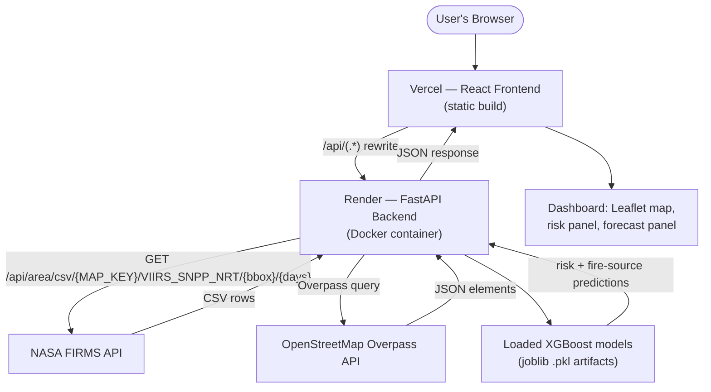
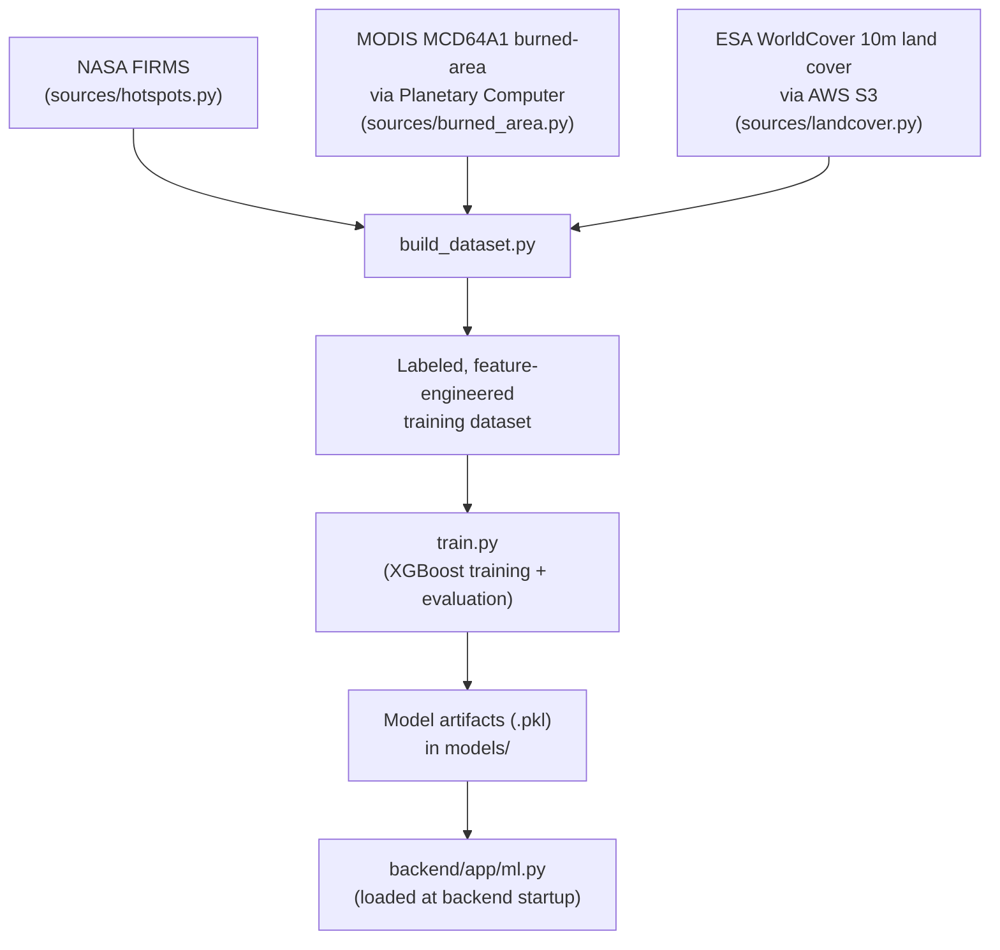

# 🔥 ThermoGuard AI

> AI-powered satellite-based detection, risk classification, and monitoring of thermal hotspots and industrial fires across India, built on NASA FIRMS satellite telemetry.


A FastAPI backend serving trained XGBoost models pulls near-real-time NASA FIRMS hotspot data, classifies wildfire risk and likely fire source, and exposes it through a React + Leaflet dashboard.

---

## 📑 Table of Contents

- [Project Overview](#-project-overview)
- [Problem Statement](#-problem-statement)
- [Proposed Solution](#-proposed-solution)
- [Key Features](#-key-features)
- [System Architecture](#-system-architecture)
- [Runtime Data Flow](#-runtime-data-flow)
- [🛰️ NASA FIRMS Integration](#️-nasa-firms-integration)
- [Live Data Polling](#-live-data-polling)
- [Backend](#️-backend)
- [API Reference](#-api-reference)
- [Machine Learning](#-machine-learning)
- [Data Pipeline](#-data-pipeline)
- [Project Structure](#-project-structure)
- [Tech Stack](#-tech-stack)
- [Local Setup](#-local-setup)
- [Environment Variables](#-environment-variables)
- [Deployment](#-deployment)
- [Vercel Rewrite](#-vercel-rewrite)
- [Troubleshooting](#-troubleshooting)
- [Security](#-security)
- [Performance](#-performance)
- [Limitations](#-limitations)
- [Roadmap](#-roadmap)
- [Use Cases](#-use-cases)
- [Team INNOV8ORS](#-team-innov8ors)
- [Contributing](#-contributing)
- [License](#-license)
- [Acknowledgements](#-acknowledgements)

---

## 🔎 Project Overview

**ThermoGuard AI** watches India for thermal hotspots detected by NASA's satellite sensors, and uses trained machine learning models to estimate how risky each hotspot is and what likely caused it — a wildfire, agricultural burning, an industrial/urban fire, or something else.

- **Satellites** (NASA's VIIRS instrument) constantly scan the Earth's surface for unusually hot spots.
- **NASA FIRMS** collects and publishes these detections as near-real-time data.
- **ThermoGuard's backend** fetches this data, runs it through two trained **XGBoost** classifiers (fire risk level, likely fire source), and cross-references nearby infrastructure via OpenStreetMap.
- **The React dashboard** shows all of this on an interactive map, so a person can see where hotspots are, how risky they look, and what's nearby — without manually checking satellite feeds.

This turns a stream of raw satellite detections into an interpretable, browsable risk picture.

## 🧩 Problem Statement

Thermal hotspots — wildfires, crop burning, industrial fires — occur across huge geographic areas that can't be manually watched in real time. Relevant, verifiable challenges this project addresses:

- **Large-area monitoring** is impractical by human observation alone.
- **Manual review of raw satellite hotspot feeds** (CSV rows of lat/lon/brightness/FRP) is not interpretable to a non-specialist.
- **Not every hotspot is equally dangerous** — a hotspot near industrial/urban infrastructure carries different risk than one in a remote forest, but raw FIRMS data doesn't classify this.
- **Awareness of a detection is not instant** — near-real-time satellite data still carries observation-to-publish latency (see [NASA FIRMS Integration](#️-nasa-firms-integration)).

## 💡 Proposed Solution

```
Satellite Observations (VIIRS)
        ↓
NASA FIRMS (near-real-time hotspot publishing)
        ↓
Backend Data Acquisition (backend/app/firms.py)
        ↓
Feature Engineering (backend/app/ml.py)
        ↓
AI/ML Inference (XGBoost risk + fire-source models)
        ↓
FastAPI Backend (backend/app/main.py)
        ↓
REST API (/api/fires, /api/predict, /api/infrastructure, /api/report)
        ↓
React Dashboard (Leaflet map, risk panel, forecast panel)
```

## ⭐ Key Features

Only features verified in the current codebase are listed.

### 🔥 Fire & Hotspot Monitoring
- Live map of NASA FIRMS hotspots restricted to an India bounding box (`68.0,6.0,97.5,37.5`)
- Per-hotspot risk filter on the dashboard (`riskFilter` state in `DashboardPage.tsx`)
- Stale-data banner when no new detections are published in the current window

### 🛰️ Satellite Data
- Live NASA FIRMS `VIIRS_SNPP_NRT` area-CSV feed (`backend/app/firms.py`)
- Automatic retry with exponential backoff on transient failures (`backend/app/retry.py`)
- 1-day → 2-day fallback window when no fresh hotspots are published yet

### 🤖 AI/ML
- XGBoost fire-risk classifier (Low / Medium / High) — `backend/app/ml.py`
- XGBoost fire-source classifier (6 classes) — same module
- Rule-based preliminary fire detection (FRP ≥ 2.40 and brightness difference ≥ 15)
- Rule-based intensity classification (FRP thresholds) and thermal-anomaly classification (brightness-difference thresholds)
- Downloadable PDF analysis report (`backend/app/report.py`, ReportLab)

### 🗺️ Visualization
- Interactive Leaflet map (`react-leaflet`) on both the dashboard and the analysis page
- Risk probability chart, feature-importance chart, forecast panel

### ⚙️ Backend
- FastAPI app (`backend/app/main.py`) with CORS middleware
- OpenStreetMap Overpass proximity lookup for nearby industrial land/roads/settlements (`backend/app/osm.py`), with mirror fallback across 3 Overpass instances
- `.env` loading via `python-dotenv`
- Structured logging around FIRMS requests (request start/success/failure, no secrets logged)
- `/api/debug/firms` diagnostic endpoint for verifying NASA FIRMS connectivity from the deployed environment

### 🌐 Frontend
- React 19 + TypeScript + Vite 8 + Tailwind CSS 4
- Two routes: `/` (live dashboard) and `/analyze` (ML prediction flow), via `react-router-dom`
- Selecting a hotspot on the dashboard prefills the `/analyze` prediction form
- 60-second dashboard auto-refresh of live hotspot data

### 🚀 Deployment
- Dockerfiles for both `backend/` and `frontend/`
- `docker-compose.yml` for running both together locally
- Frontend deployed on **Vercel** with an `/api/*` rewrite proxy to the Render backend
- Backend deployed on **Render** as a Docker web service

### 🔧 Developer Features
- Interactive OpenAPI docs at `/docs` (FastAPI default)
- `/api/health` and `/api/meta` introspection endpoints (model readiness, feature list, feature importances)

**Not implemented** (do not assume otherwise): user authentication, a persistent database, push notifications/alerts, forecasting beyond the existing heuristic forecast panel, or automatic fire ignition detection at the moment it starts.

## 🏗️ System Architecture



Separately, the offline training pipeline that produces the model artifacts the backend loads:



## 🔄 Runtime Data Flow

For the live hotspot feed (`/api/fires`), verified against the actual code:

1. User opens the dashboard (`DashboardPage.tsx`).
2. React frontend mounts and calls `fetchFires()` (`frontend/src/lib/api.ts`).
3. Browser sends `GET /api/fires` (relative path).
4. Vercel's rewrite (`frontend/vercel.json`) proxies this to the Render backend.
5. FastAPI's `fires()` route (`backend/app/main.py`) receives the request.
6. It calls `firms.fetch_live_fires(bbox, days=1)`.
7. That function requests NASA FIRMS's area-CSV endpoint, retrying transient failures.
8. If zero rows come back for `days=1`, it re-requests with `days=2` and marks the response `stale: true`.
9. The CSV response is parsed via `csv.DictReader` into a list of row dicts.
10. `main.py` wraps the rows into a JSON response (`success`, `count`, `source`, `satellite`, `stale`, `fires`).
11. The frontend receives this JSON and updates `fires` / `staleFires` state.
12. The Leaflet map and risk panel re-render with the new hotspot data.

For the ML prediction flow (`/api/predict`), a user (manually, via the `/analyze` page's form or sliders) submits satellite-observation fields, which `backend/app/ml.py` turns into an engineered feature row, runs through the loaded risk and fire-source XGBoost models, and returns predicted risk level, confidence, probabilities, fire-source classification, and rule-based intensity/thermal/fire-detection results.

## 🛰️ NASA FIRMS Integration

[NASA FIRMS](https://firms.modaps.eosdis.nasa.gov/) (Fire Information for Resource Management System) distributes near-real-time thermal hotspot detections from polar-orbiting satellite instruments (VIIRS, MODIS).

**Current configuration** (`backend/app/firms.py`):

| Setting | Value |
|---|---|
| Base endpoint | `https://firms.modaps.eosdis.nasa.gov/api/area/csv` |
| Source | `VIIRS_SNPP_NRT` |
| Default bounding box | `68.0,6.0,97.5,37.5` (India) |
| Auth | `NASA_FIRMS_MAP_KEY` env var, appended into the request path |
| Response format | CSV, parsed via `csv.DictReader` |
| Retry | up to 3 attempts, exponential backoff, only for transient errors (timeouts, connection errors, 5xx) — see `backend/app/retry.py` |
| Stale fallback | if `days=1` returns zero rows, retries with `days=2` and flags the response `stale: true` |

**Important — NASA FIRMS is near-real-time, not instantaneous.** A fire igniting does not appear in this dashboard the moment it starts. The actual chain is:

```
Fire/thermal event occurs
        ↓
Satellite (VIIRS) passes overhead and observes the thermal signal
        ↓
NASA processes the raw satellite pass into a hotspot detection
        ↓
NASA FIRMS publishes the detection via its API
        ↓
ThermoGuard's backend retrieves it on its next request
```

Satellite instruments are polar-orbiting, so any single point on Earth is only observed a limited number of times per day — the exact timing varies by orbit and is not something this project controls or guarantees. Do not treat "no hotspot showing" as "no thermal event has occurred" — it may simply not have been observed and published yet.

## ⏱️ Live Data Polling

The dashboard (`frontend/src/pages/DashboardPage.tsx`) re-fetches `/api/fires` every **60 seconds** (`REFRESH_INTERVAL_MS = 60 * 1000`).

This 60-second interval is the **application's polling frequency** — it is not related to how often the satellite observes the Earth, and it does not mean new detections are generated every 60 seconds. Its actual purpose:

- To pick up newly *published* FIRMS data as soon as possible after NASA processes it.
- It cannot create data that doesn't exist yet — if NASA hasn't published a new pass, repeated polling returns the same rows.

Three distinct rates are at play, and they are not the same thing:

| Rate | Controlled by | Typical cadence |
|---|---|---|
| Application polling frequency | This project (`DashboardPage.tsx`) | Every 60 seconds |
| Satellite observation frequency | NASA / satellite orbit | A handful of passes per day per location |
| FIRMS processing/publishing latency | NASA FIRMS | Not fixed or guaranteed by this project |

## ⚙️ Backend

FastAPI application at `backend/app/main.py`.

- **App structure**: `main.py` (route wiring), `ml.py` (model loading + feature engineering + inference), `firms.py` (live NASA FIRMS feed), `osm.py` (Overpass infrastructure lookup), `report.py` (PDF generation), `schemas.py` (Pydantic request/response models), `retry.py` (shared backoff helper).
- **CORS**: `CORSMiddleware` currently allows only `http://localhost:5173` and `http://127.0.0.1:5173` (`main.py`). In production, the frontend's requests reach the backend via Vercel's server-side rewrite, so the browser's request stays same-origin against Vercel and doesn't require the backend to allow the Vercel origin directly.
- **Environment loading**: `load_dotenv()` reads a `.env` file from the repo root at startup.
- **Error handling**: missing NASA FIRMS key → `503`; NASA FIRMS/Overpass request failures → `502` with the exception message; unready ML models → `503`.
- **Logging**: `logging.basicConfig(level=logging.INFO)`; FIRMS requests log start, success (with HTTP status), and failure (with error type) — the `NASA_FIRMS_MAP_KEY` value and full request URL are never logged (see `_redact_key()` in `firms.py`).

### `GET /api/fires`

- **Purpose**: returns live NASA FIRMS hotspots for the requested area.
- **Query parameters**: `bbox` (default: India bounding box `68.0,6.0,97.5,37.5`), `days` (default: `1`).
- **Stale-data behavior**: if the `days=1` request returns zero rows, the backend automatically retries with `days=2` and sets `"stale": true` in the response so the frontend can show a banner.
- **Response fields**: `success`, `count`, `source`, `satellite`, `stale`, `fires` (list of raw FIRMS CSV row dicts).

### `GET /api/debug/firms`

> ⚠️ **DEVELOPMENT / DIAGNOSTIC ENDPOINT** — added to troubleshoot a Render deployment connectivity issue, not part of the core product feature set.

Checks, without ever returning the raw key:
- Whether `NASA_FIRMS_MAP_KEY` is present in the environment (`key_configured`).
- Whether the server can reach `firms.modaps.eosdis.nasa.gov`'s key-status endpoint (`dns_reachable`).
- The HTTP status NASA FIRMS returned (`firms_status`).
- The key-status response body (transaction limit/usage) when reachable, or a redacted error type/message when not.

## 📋 API Reference

| Method | Endpoint | Purpose |
|---|---|---|
| GET | `/api/health` | Model-readiness check |
| GET | `/api/meta` | Feature columns, risk classes, feature importances, documented model performance |
| POST | `/api/predict` | Run risk + fire-source prediction on a manually supplied hotspot record |
| POST | `/api/report` | Same as `/api/predict`, returned as a downloadable PDF |
| GET | `/api/fires` | Live NASA FIRMS hotspot feed |
| GET | `/api/debug/firms` | ⚠️ Diagnostic — NASA FIRMS connectivity check |
| GET | `/api/infrastructure` | OSM Overpass proximity lookup (industrial land, roads, settlements) for a lat/lon |

<details>
<summary>Example: <code>GET /api/fires</code> response shape</summary>

```json
{
  "success": true,
  "count": 12,
  "source": "NASA FIRMS",
  "satellite": "VIIRS_SNPP_NRT",
  "stale": false,
  "fires": [ { "latitude": "...", "longitude": "...", "brightness": "...", "...": "..." } ]
}
```
</details>

<details>
<summary>Example: <code>GET /api/debug/firms</code> response shape</summary>

```json
{
  "key_configured": true,
  "dns_reachable": true,
  "firms_status": 200,
  "firms_response": { "transaction_limit": 5000, "current_transactions": 2, "transaction_interval": "10 minutes" }
}
```
</details>

Full interactive schema for every field: run the backend and open `/docs`.

## 🤖 Machine Learning

Model loading and inference: `backend/app/ml.py`. Model artifacts: `models/` (see `models/README.md` for the full active-vs-retired breakdown).

| Model | Purpose | Input | Output | Artifact |
|---|---|---|---|---|
| Risk classifier | Predict wildfire risk level | Engineered hotspot features (lat/lon, brightness, FRP, scan/track, time-based cyclical features, etc. — see `ml.py: build_input_data`) | `Low` / `Medium` / `High` + class probabilities | `models/thermoguard_risk_v3.pkl` (+ `label_encoder_risk_v3.pkl`, `feature_columns_risk_v3.pkl`) |
| Fire-source classifier | Predict likely fire source category | Same engineered feature set, reindexed to its own feature list | `Wildfire` / `Agricultural Fire` / `Industrial/Urban Fire` / `Offshore` / `Other` / `Unknown` + confidence | `models/thermoguard_fire_source_v3.pkl` (+ `fire_source_label_encoder_v3.pkl`, `fire_source_features_v3.pkl`) |

Both are **XGBoost** classifiers (per `models/README.md` and `/api/meta`'s reported `"model": "XGBoost"`).

**Documented evaluation** (from `models/README.md` / `/api/meta`, not independently re-verified here — treat as the project's own reported figures):
- Risk model: 86.68% 70/30 holdout test accuracy, 86.79% 5-fold CV mean. Per-class F1: Low 0.94, High 0.68, Medium 0.27 (weakest, genuinely ambiguous middle class).
- Fire-source model: 82.17% 70/30 holdout test accuracy, 82.51% 5-fold CV mean. Per-class F1: Wildfire 0.86, Agricultural Fire 0.81, Industrial/Urban Fire 0.53, Other 0.59, Offshore 0.18, Unknown 0.64.

Trained on a 248,308-row pull (Jan 2025–Sep 2026, all India) via `data-pipeline/`, using sqrt-dampened class-balanced sample weights (`train.py`) so the minority classes stay learnable without collapsing majority-class accuracy. Full per-class reports live in `data-pipeline/output/models_2025_2026_softened/metrics.json` (this file is gitignored — generated locally by running the pipeline, not committed to the repo).

**Additional rule-based (non-ML) logic in `ml.py`**:
- `detect_fire()` — preliminary fire flag: `FRP ≥ 2.40 and brightness_difference ≥ 15`.
- `classify_intensity()` — FRP-threshold buckets (Very High / High / Medium / Low).
- `classify_thermal()` — brightness-difference threshold buckets.

Fire-source land cover is a **correlate** of likely fire origin, not a confirmed cause — this is stated explicitly in `data-pipeline/README.md` and preserved here.

## 🔬 Data Pipeline

`data-pipeline/` builds the training dataset the models above are trained on. See `data-pipeline/README.md` for full detail; summarized here:

```
Data Sources (NASA FIRMS hotspots, MODIS MCD64A1 burned-area, ESA WorldCover land cover)
        ↓
sources/hotspots.py, sources/burned_area.py, sources/landcover.py
        ↓
build_dataset.py — joins sources, engineers features identical to backend/app/ml.py's schema
        ↓
Labeled, feature-engineered training dataset
        ↓
train.py — trains + evaluates the risk and fire-source XGBoost models
        ↓
Model artifacts (.pkl) → models/
```

- **Risk label**: whether the hotspot corresponds to an actual MODIS-mapped burn within 30 days (real outcome), not an arbitrary FRP threshold.
- **Fire-source label**: real ESA WorldCover land-cover class at the hotspot's location.
- **Geographic scope**: India (`INDIA_BBOX`).
- Known limitations of this pipeline (burn-size proxy, offshore land-cover gaps, FRP kept only as a reference column) are documented in `data-pipeline/README.md`.

## 📁 Project Structure

```
THERMOGUARD-ML/
├── docker-compose.yml          # wires backend + frontend containers together
├── backend/
│   ├── Dockerfile
│   ├── requirements.txt
│   └── app/
│       ├── main.py             # FastAPI app, route wiring, CORS, logging config
│       ├── ml.py                # model loading, feature engineering, prediction
│       ├── firms.py              # live NASA FIRMS hotspot feed + diagnostics
│       ├── osm.py                 # OSM Overpass infrastructure-proximity lookup
│       ├── report.py               # PDF report generation (ReportLab)
│       ├── schemas.py               # Pydantic request/response models
│       └── retry.py                  # shared exponential-backoff retry helper
├── frontend/
│   ├── Dockerfile
│   ├── nginx.conf               # serves the built app + proxies /api (Docker mode)
│   ├── vercel.json               # Vercel build + /api rewrite (production)
│   ├── vite.config.ts             # dev-server /api proxy to localhost:8000
│   ├── package.json
│   └── src/
│       ├── pages/                  # DashboardPage.tsx, AnalyzePage.tsx
│       ├── components/               # form, results, charts, map, etc.
│       ├── components/dashboard/       # live hotspot map, risk/forecast panels
│       ├── components/fx/                # animated UI primitives
│       ├── components/layout/              # Nav, Footer
│       ├── components/ui/                   # shared field/slider primitives
│       ├── lib/                               # api.ts, aiRisk.ts, risk.ts, fires.ts
│       └── App.tsx
├── data-pipeline/               # training-data construction + training script
│   ├── sources/                   # hotspots.py, burned_area.py, landcover.py
│   ├── build_dataset.py             # orchestrates sources/ into a labeled dataset
│   ├── train.py                       # trains + evaluates the models
│   └── README.md                        # data sourcing details, scope, known limits
├── models/                       # trained .pkl artifacts — see models/README.md
├── legacy/                       # superseded training scripts, reference only
├── docs/                         # Dashboard_Design.md, a sample PDF report
├── .gitignore / .dockerignore
├── followIT.txt                  # this README's generation instructions
└── README.md
```

## 🧰 Tech Stack

| Layer | Technology | Purpose |
|---|---|---|
| Frontend | React 19, TypeScript, Vite 8 | UI framework, build tooling |
| Frontend | Tailwind CSS 4 | Styling |
| Frontend | react-router-dom 7 | Client-side routing (`/`, `/analyze`) |
| Frontend | Leaflet, react-leaflet | Interactive hotspot map |
| Frontend | motion, lucide-react | Animation, icons |
| Backend | FastAPI, Uvicorn | REST API server |
| Backend | python-dotenv | `.env` loading |
| AI/ML | XGBoost, LightGBM*, scikit-learn, joblib | Model training/inference (*LightGBM is an installed dependency and has retired artifacts in `models/`, but the currently-loaded models are XGBoost) |
| Data | pandas, numpy | Feature engineering |
| Reporting | ReportLab | PDF report generation |
| External Data | NASA FIRMS | Live satellite hotspot detections |
| External Data | OpenStreetMap Overpass API | Infrastructure proximity |
| Data Pipeline | geopandas, shapely, rasterio, pystac-client, planetary-computer | Training-data construction (MODIS burned-area, ESA WorldCover) |
| Deployment | Docker | Containerization (both backend and frontend) |
| Deployment | Vercel | Frontend hosting + API rewrite proxy |
| Deployment | Render | Backend hosting (Docker web service) |

## 🚀 Local Setup

### Prerequisites

| Tool | Version | Check |
|---|---|---|
| Python | 3.11 (matches `backend/Dockerfile`'s base image) | `python --version` |
| Node.js | 18+ | `node --version` |
| npm | 9+ | `npm --version` |

### 1. Clone

```bash
git clone https://github.com/panipatwar2026-lab/ThermoGuard-AI.git
cd ThermoGuard-AI
```

### 2. Backend

```bash
cd backend
python -m venv .venv
```

Activate the virtual environment:

```bash
# Windows PowerShell
.venv\Scripts\Activate.ps1

# Linux / macOS
source .venv/bin/activate
```

```bash
pip install -r requirements.txt
```

Set the required environment variable (see [Environment Variables](#-environment-variables)) before starting the server.

Run the API from the **repository root** (so it can resolve `models/` correctly):

```bash
python -m uvicorn app.main:app --reload --port 8000
```

Verify:

```bash
curl http://localhost:8000/api/health
```

Interactive docs: http://localhost:8000/docs

### 3. Frontend

In a second terminal:

```bash
cd frontend
npm install
npm run dev
```

Open http://localhost:5173 — the Vite dev server proxies `/api/*` to `http://localhost:8000` (`frontend/vite.config.ts`), so both servers must be running.

### 4. Docker (alternative to steps 2–3)

```bash
docker compose up --build
```

- Frontend: http://localhost:3000
- Backend: http://localhost:8000

## 🔑 Environment Variables

| Variable | Required | Component | Description |
|---|---|---|---|
| `NASA_FIRMS_MAP_KEY` | Yes | Backend | Free NASA FIRMS API key — register at https://firms.modaps.eosdis.nasa.gov/api/map_key/. Required for `/api/fires` and `/api/debug/firms`. |

```bash
# .env (repo root, never committed)
NASA_FIRMS_MAP_KEY=your_key_here
```

Never commit real secrets to the repository. In production, set this as a platform secret/environment variable (Render dashboard, Vercel project settings, etc.) rather than shipping a `.env` file.

## ☁️ Deployment

Current production architecture:

```
GitHub (panipatwar2026-lab/ThermoGuard-AI)
├── frontend/  → Vercel  (static build + /api rewrite)
└── backend/   → Render  (Docker web service)
```

```
Vercel Frontend
    ↓
Vercel Rewrite (/api/(.*))
    ↓
Render FastAPI Backend  →  https://thermoguard-ai.onrender.com
    ↓
NASA FIRMS
```

- **Backend**: deployed on Render as a Docker web service built from `backend/Dockerfile`. Health check path: `/api/health`.
- **Frontend**: deployed on Vercel, framework preset `vite`, build command `npm run build`, output directory `dist` (`frontend/vercel.json`).
- **Current backend URL**: `https://thermoguard-ai.onrender.com`

## 🔀 Vercel Rewrite

`frontend/vercel.json` currently rewrites:

```json
{ "source": "/api/(.*)", "destination": "https://thermoguard-ai.onrender.com/api/$1" }
```

The frontend code only ever calls **relative** paths — e.g. `fetch('/api/fires')` in `frontend/src/lib/api.ts` — it has no concept of an absolute backend URL and no environment variable overrides this (verified: no `VITE_*`/`import.meta.env`/`process.env` usage anywhere in `frontend/src`). Vercel's rewrite is what forwards these relative `/api/*` requests server-side to the Render backend, keeping the browser's request same-origin against the Vercel domain.

## 🩺 Troubleshooting

### Backend doesn't start
- Check Python version matches `backend/Dockerfile` (3.11-slim base image).
- Check all of `backend/requirements.txt` installed cleanly.
- Check `NASA_FIRMS_MAP_KEY` is set (missing key alone won't crash startup, but `/api/fires` will return `503`).
- Confirm you're running Uvicorn from the correct working directory so `models/` resolves.

### NASA FIRMS fails
- Check `NASA_FIRMS_MAP_KEY` is set and valid.
- Check outbound network/DNS connectivity from the hosting environment.
- Check NASA FIRMS service status independently.
- Check Render logs for the `FIRMS request started/succeeded/failed` log lines (`firms.py`).
- Hit `/api/debug/firms` directly to isolate the failure point (key missing vs. DNS vs. NASA-side error).

### Vercel shows a 502 / DNS error on `/api/*`
- Check `frontend/vercel.json`'s rewrite destination is a real, currently-deployed hostname.
- Confirm the Render backend is actually running (hit its `/api/health` directly).
- Check the browser Network tab for the actual proxied request/response.
- Confirm the latest Vercel deployment picked up the current `vercel.json`.

### CORS errors
- Check `backend/app/main.py`'s `CORSMiddleware` `allow_origins` list — it currently only lists local dev origins. If calling the backend directly (not through the Vercel rewrite) from a browser on another origin, this will block the request.

### Render cold start
- Render's free tier can spin down an idle service and take tens of seconds to wake on the next request — this is a hosting-platform characteristic, not an application bug.

## 🔒 Security

Verified from the current codebase:

- `NASA_FIRMS_MAP_KEY` is read from an environment variable, never hardcoded (`firms.py: _map_key()`).
- `.env` is excluded via `.gitignore` and `.dockerignore` — never baked into a Docker image or committed.
- `/api/debug/firms` never returns the raw key, and redacts it out of any request-exception text before returning or logging it (`_redact_key()`).
- FIRMS request logging never logs the key or the full request URL.
- CORS middleware is explicitly configured (currently scoped to local dev origins).

**`NASA_FIRMS_MAP_KEY` must NEVER be committed to Git.**

Not currently implemented: authentication, rate limiting, request input sanitization beyond Pydantic's own type validation, or security headers beyond FastAPI/Starlette defaults.

## ⚡ Performance

Verified behavior from the current code:

- Dashboard polls `/api/fires` every 60 seconds (`DashboardPage.tsx`).
- Outbound FIRMS/Overpass requests retry transient failures (timeouts, connection errors, 5xx) up to 2–3 times with exponential backoff (`retry.py`), but do **not** retry on 4xx (a bad key won't be retried away).
- `/api/fires` falls back from a 1-day to a 2-day window automatically when no fresh rows exist, avoiding an empty map.
- The Overpass lookup tries up to 3 mirror instances in sequence if one is overloaded (`osm.py`).
- ML model artifacts are loaded once at backend process startup (module-level `joblib.load()` calls in `ml.py`), not per-request.
- Render's free tier may introduce cold-start latency after idle periods (hosting-platform behavior, not application-controlled).

## ⚠️ Limitations

- NASA FIRMS is near-real-time, not instantaneous — see [NASA FIRMS Integration](#️-nasa-firms-integration). A new thermal event is **not guaranteed** to appear immediately.
- Satellite revisit frequency is limited by orbit — a given point on Earth is only observed a handful of times per day.
- Fire-source classification is based on land cover at the hotspot's location, a **correlate**, not a confirmed cause.
- The risk and fire-source models' weakest classes (Medium risk, Offshore/Unknown source) have documented lower F1 scores — see [Machine Learning](#-machine-learning).
- "Fire detected" is a preliminary rule-based threshold check, not a dedicated trained binary classifier.
- Geographic scope is currently limited to the configured India bounding box.
- This project has no automated test suite currently present in the repository.
- Free-tier hosting (Render) may introduce startup latency after idle periods.
- CORS is currently scoped to local development origins only, relying on Vercel's server-side rewrite for production same-origin access.

## 🗺️ Roadmap

### ✅ Current
- Live NASA FIRMS hotspot dashboard (India)
- XGBoost risk + fire-source classification
- OSM infrastructure-proximity lookup
- PDF report generation
- Docker-based local dev, Vercel + Render production deployment

### 🔄 Planned
- None currently documented in the repository beyond the items already implemented.

### 💡 Future Possibilities
*(speculative — not implemented, not committed to)*
- Additional satellite data sources beyond `VIIRS_SNPP_NRT`
- Historical hotspot analytics/trends
- Alerting/notification system
- Persistent database for hotspot history
- User authentication/accounts
- Advanced forecasting beyond the current heuristic forecast panel
- Mobile application

## 🎯 Use Cases

Based on the project's actual, implemented capabilities:

- **Thermal hotspot monitoring** across India using live NASA FIRMS data.
- **Educational/academic demonstration** of an end-to-end satellite-data-to-ML-to-dashboard pipeline.
- **Research/prototyping reference** for combining satellite hotspot data with land-cover and infrastructure context.

Potential (not currently implemented) applications this architecture could be extended toward include broader disaster-management support or industrial-site-specific monitoring — these are possibilities, not existing features.

## 👥 Team INNOV8ORS

**Department:** Artificial Intelligence and Data Science
**Program:** TY B.Tech
**Group:** INNOV8ORS

| Role | Name | Email |
|---|---|---|
| Team Leader | Shinde Shreya Santosh | Shindeshreya2105@gmail.com |
| Team Member | Mudrale Swarali Shailesh | ssmudrale1@gmail.com |
| Team Member | More Pranali Rajesh | pranalimore9696@gmail.com |
| Team Member | Shaikh Toufik Firoj | ts8080shaikh@gmail.com |
| Team Member | Patil Mithil Manoj | mithilpatil207@gmail.com |
| Team Member | Dhanawade Ritesh Jaywant | riteshdhanawade250@gmail.com |

## 🤝 Contributing

1. Fork the repository
2. Clone your fork
3. Create a feature branch
4. Make your changes
5. Test locally
6. Commit your changes
7. Push to your fork
8. Open a pull request

## 📄 License

License: Not currently specified.

## 🙏 Acknowledgements

- [NASA FIRMS](https://firms.modaps.eosdis.nasa.gov/) — near-real-time satellite hotspot data
- [MODIS MCD64A1](https://planetarycomputer.microsoft.com/dataset/modis-64A1-061) via Microsoft Planetary Computer — burned-area ground truth
- [ESA WorldCover](https://esa-worldcover.org/) — land-cover classification
- [OpenStreetMap](https://www.openstreetmap.org/) / Overpass API — infrastructure proximity data
- React, Vite, Tailwind CSS, FastAPI, XGBoost, scikit-learn, ReportLab
